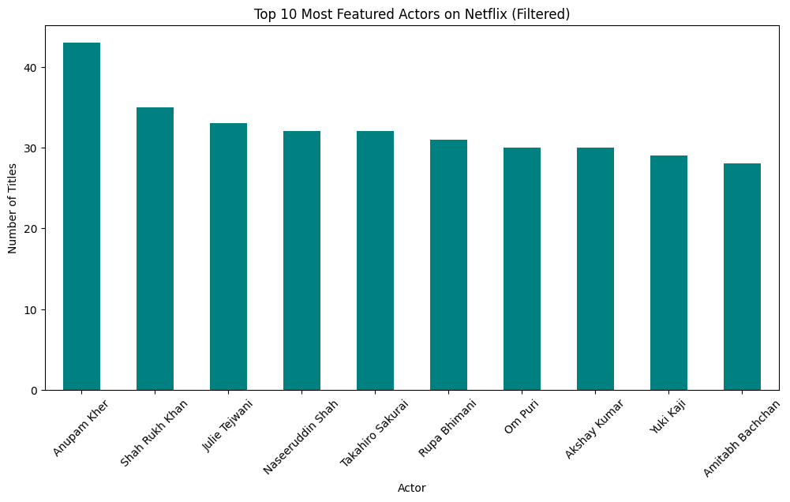
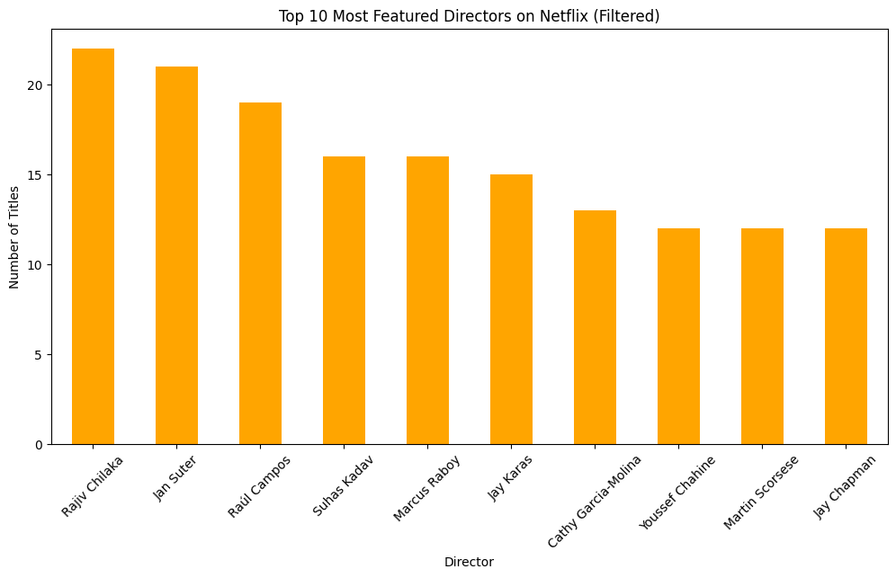
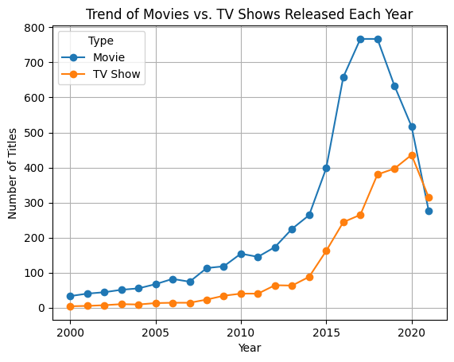
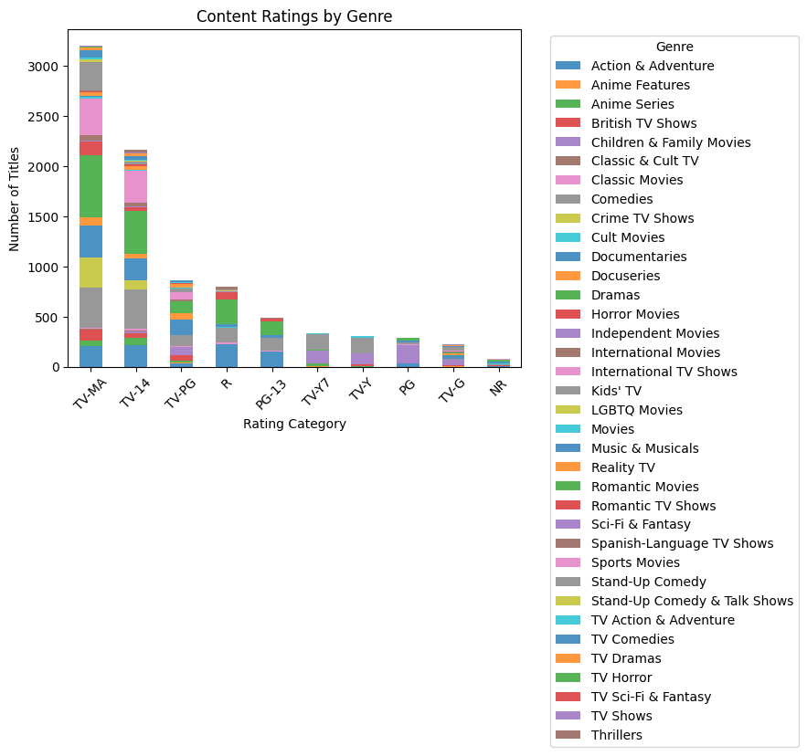
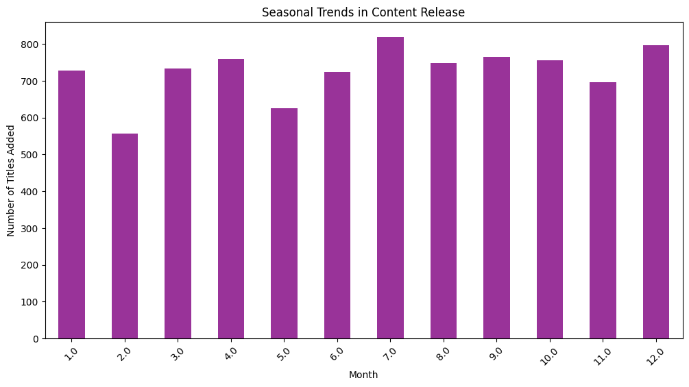
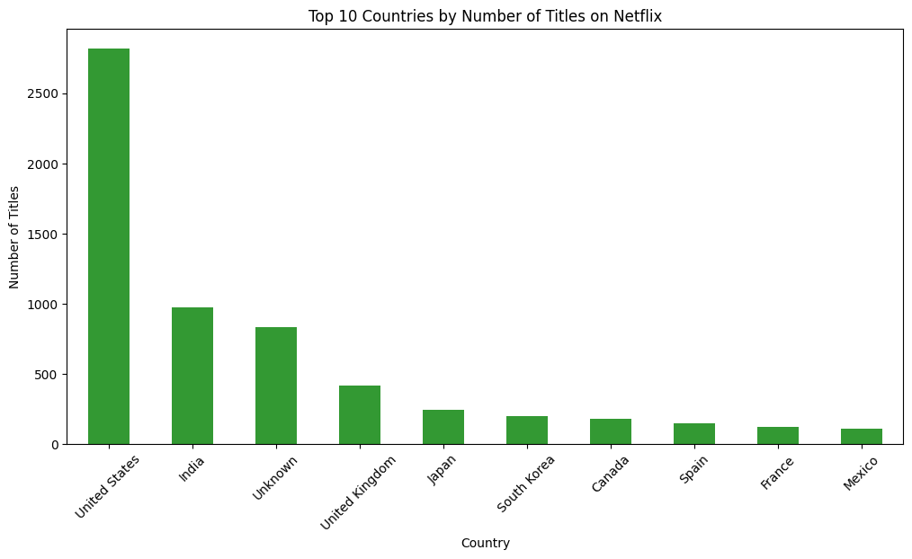
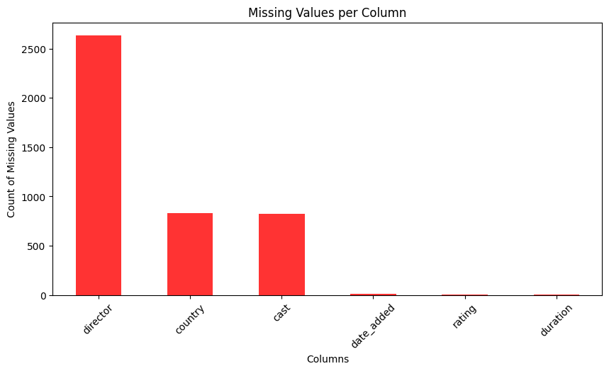
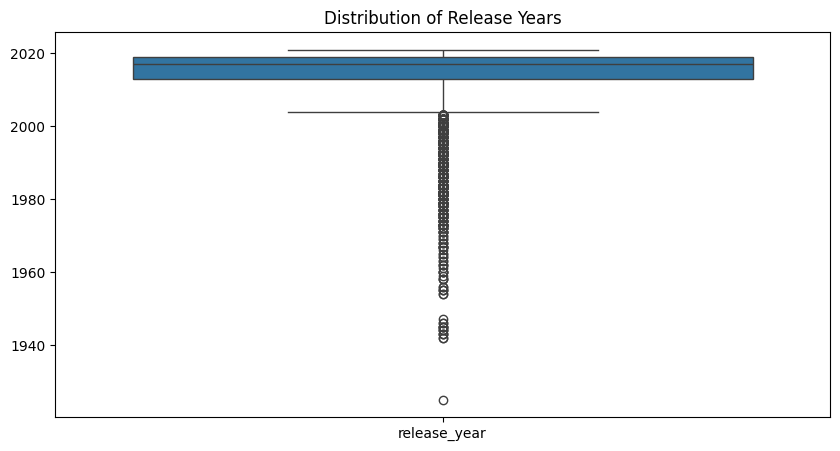

# Netflix Business Analysis

## 📊 Content by Country
# The United States, India, the UK, and Canada have the highest number of Netflix titles.
# The U.S. dominates in both movies and TV shows.
# India has a significantly higher proportion of movies compared to TV shows.

## 🎬 Movie Release Trends

## 📈 Movies vs TV Shows

## 📆 Best Time to Launch a TV Show

## 🎭 Top 10 Most Featured Actors (Filtered)

## 🎬 Top 10 Most Featured Directors (Filtered)

## 📊 Trend of Movies vs. TV Shows Over the Years

## ⭐ Content Ratings by Genre

## 📅 Seasonal Trends in Content Release

## 🌍 Top 10 Countries by Total Netflix Content

## 🔎 Data Preprocessing

