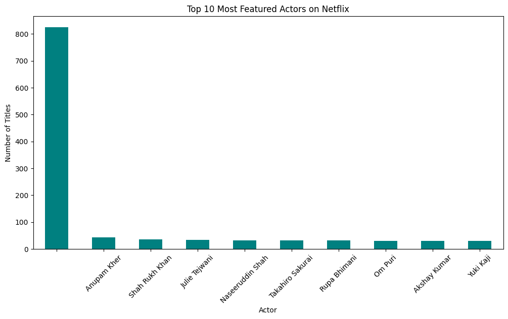
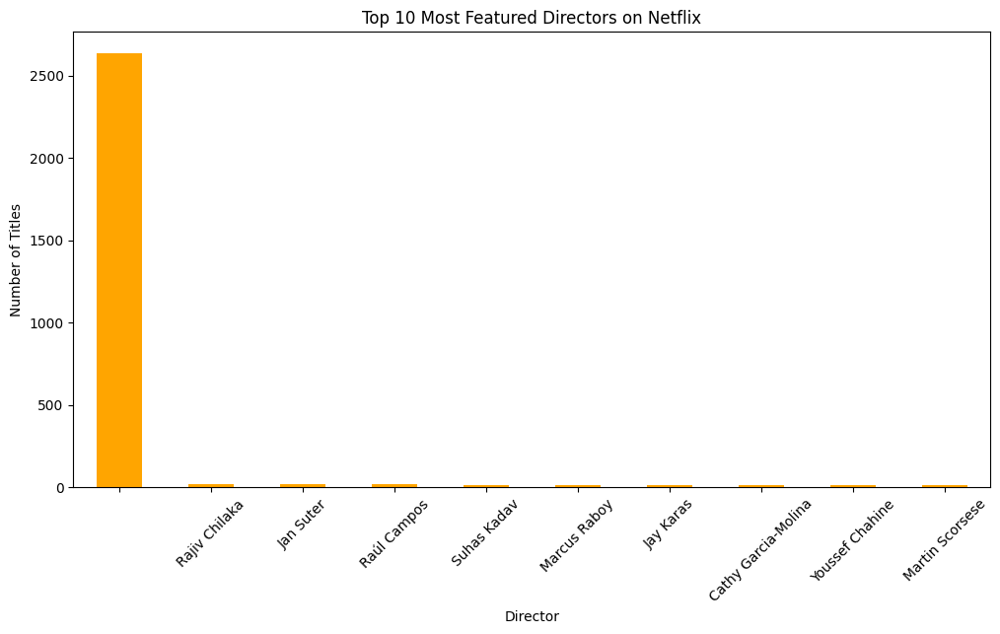

# Netflix Business Analysis

## 📊 Content by Country

## 🎬 Movie Release Trends

## 📈 Movies vs TV Shows

## 📆 Best Time to Launch a TV Show

## 🎭 Top 10 Most Featured Actors

## 🎬 Top 10 Most Featured Directors

## 📊 Trend of Movies vs. TV Shows Over the Years

## ⭐ Content Ratings by Genre

## 📅 Seasonal Trends in Content Release

## 🌍 Top 10 Countries by Total Netflix Content

