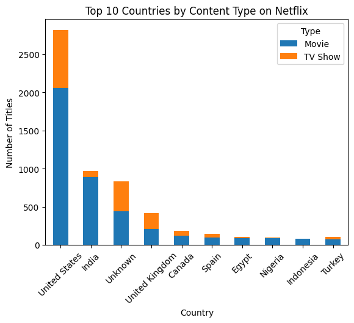

# Netflix Business Analysis

## 📊 Content by Country
The United States, India, the UK, and Canada have the highest number of Netflix titles.
The U.S. dominates in both movies and TV shows.
India has a significantly higher proportion of movies compared to TV shows.

## 🎬 Movie Release Trends
The number of movies released on Netflix has increased significantly over the past 20–30 years.
2017–2020 saw a peak in movie releases, followed by a slight decline.

## 📈 Movies vs TV Shows
Movies outnumber TV shows, but the share of TV shows has been increasing in recent years.
Netflix appears to be shifting focus toward TV shows over movies.

## 📆 Best Time to Launch a TV Show
September to December is the peak period for adding TV shows.
Summer months (June–August) see relatively fewer TV show additions, likely reflecting user viewing habits.

## 🎭 Top 10 Most Featured Actors (Filtered)
Anupam Kher, Shah Rukh Khan, and other Indian actors appear most frequently.

## 🎬 Top 10 Most Featured Directors (Filtered)
Rajiv Chilaka is the most featured director, likely due to high-volume animation productions.
After filtering for extreme values, Hollywood and European actors and directors rank higher.

## 📊 Trend of Movies vs. TV Shows Over the Years
TV shows have seen a significant rise since the 2010s.
Since 2017, Netflix has released more TV shows than movies, suggesting a shift in content strategy.
This aligns with a subscriber retention strategy, where long-form TV series help keep users engaged.

## ⭐ Content Ratings by Genre
TV-MA (Mature Audience) is the most common rating, indicating Netflix primarily targets adult viewers.
Family-friendly content (TV-Y, G) is relatively scarce.
Drama, documentary, and comedy genres dominate PG-13 and R-rated content.

## 📅 Seasonal Trends in Content Release
The highest volume of new content is added between September and December.
November and December see the most releases, possibly due to strategic content scheduling around the holiday season.

## 🌍 Top 10 Countries by Total Netflix Content
The U.S. has the highest number of titles, followed by India, the UK, Canada, and Japan.
Certain genres dominate specific regions (e.g., Bollywood in India, anime in Japan).

## 🔎 Data Preprocessing

